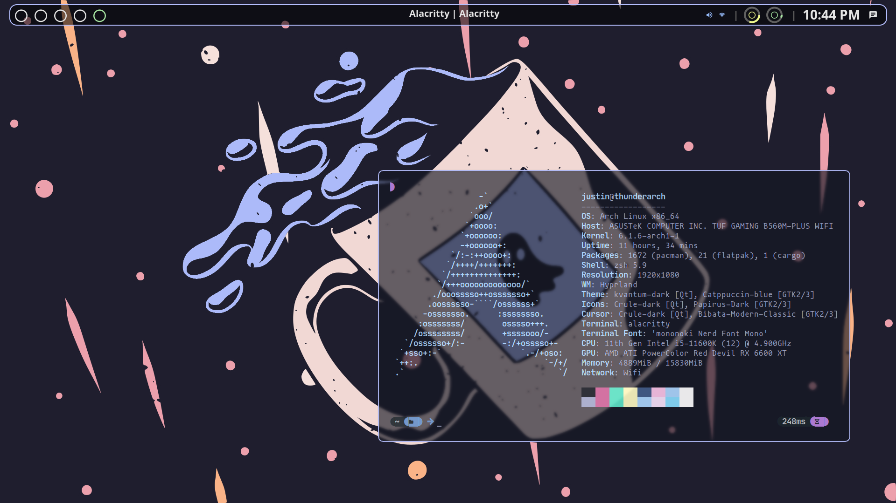

# dotfile

# Stuff 
* gtk theme: [Catppuccin-Mocha-Blue](https://github.com/catppuccin/gtk)
* icon theme: [Catppuccin-Mocha-Folders](/github.com/catppuccin/papirus-folders)
* mouse cursor: [Bibata-Modern-Classic](https://github.com/ful1e5/Bibata_Cursor)
* kvantum/qt theme: [Catppuccin-Mocha-Blue](https://github.com/catppuccin/Kvantum)
* firefox theme: [Catpuccin-Mocha-Blue](https://github.com/catppuccin/firefox)
