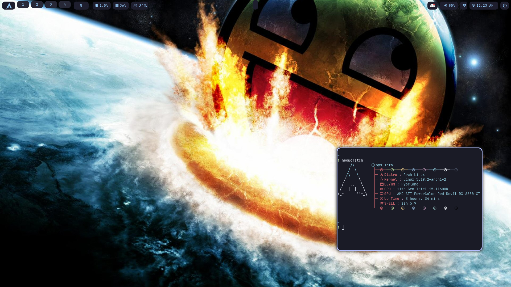

# dotfile

# Stuff 
* gtk theme: [Catpuccin-blue](https://github.com/catppuccin/gtk)
* icon theme: [Dracula](https://github.com/dracula/gtk/files/5214870/Dracula.zip)
* mouse cursor: [Bibata-Modern-Classic](https://github.com/ful1e5/Bibata_Cursor)
* kvantum/qt theme: [Catppuccin-Macchiato-Blue](https://github.com/catppuccin/Kvantum)
